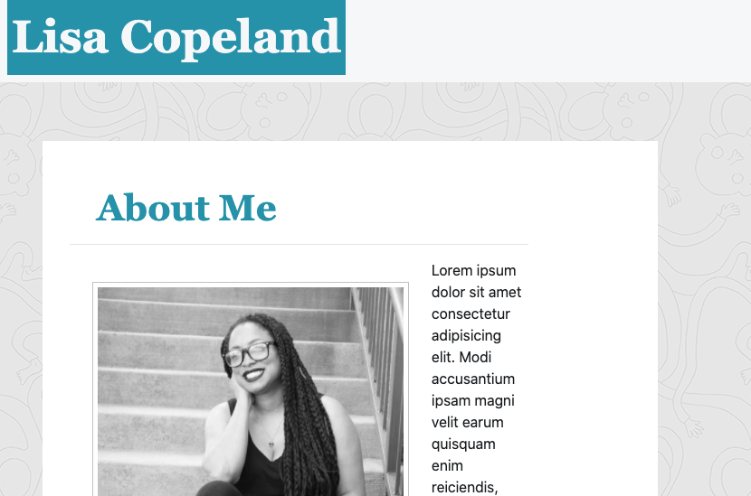

# Portfolio 🏆 Lisa Copeland

## Description 


## Table of Contents


* [Installation](#installation)
* [Usage](#usage)
* [Credits](#credits)
* [License](#license)


## Installation
### Steps required to run locally
1. Clone/download the code in this repo
2. Navigate to the location of the code downloaded
3. Double-click on the html file provided in the downloaded code to preview
### Steps required to run online
1. Click the "VIEW SITE" link at the bottom of this README

## Usage 

```md

```
## View Website
Click here to view the live website [VIEW SITE](https://stopdaydreaming.github.io/super-duper-octo-portfolio/)


## Credits
1 contributor: @stopdaydreaming
### Resources
https://css-tricks.com/couple-takes-sticky-footer/
https://getbootstrap.com/docs/4.5/examples/sticky-footer/
https://getbootstrap.com/docs/4.5/utilities/spacing/

## License
Copyright (c) Lisa Copeland. All rights reserved.
Licensed under the [MIT](license.txt) license.

## Features


## Contributing


## Tests

## Badges


